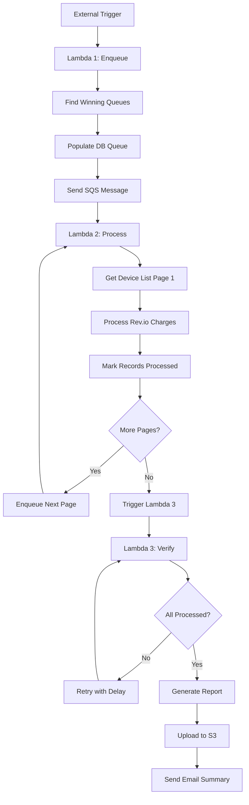
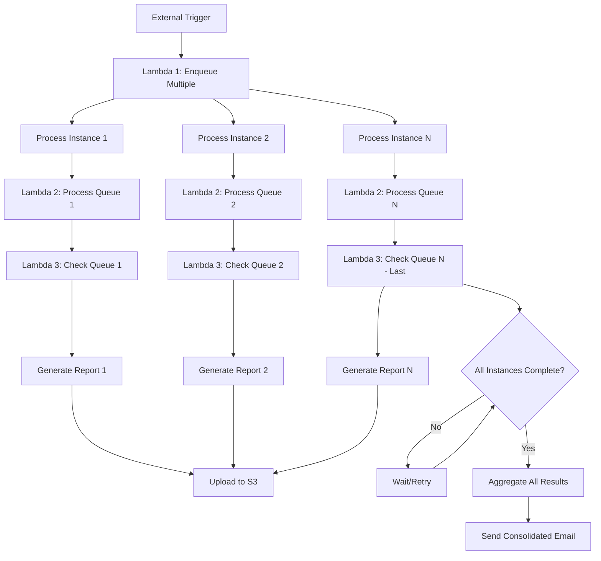

# Non-Recurring Customer Charges System - End-to-End Flow Documentation

## Overview

The Non-Recurring Customer Charges system processes customer billing charges through a three-lambda architecture that handles charge enqueueing, processing, and verification. This system integrates with Rev.io billing APIs and provides comprehensive reporting and notification capabilities.

## Architecture Overview

```
[External Trigger] 
    ↓
[Lambda 1: AltaworxRevAWSEnqueueCustomerCharges] 
    ↓ (SQS Messages)
[Lambda 2: AltaworxRevAWSCreateCustomerChange] 
    ↓ (SQS Messages)
[Lambda 3: AltaworxRevAWSCheckCustomerChargeIsProcessed]
```

---

## 🎯 Lambda 1: AltaworxRevAWSEnqueueCustomerCharges

### Purpose
Initial trigger that identifies winning optimization queues and enqueues them for customer charge processing.

### Key Files
- **`AltaworxRevAWSEnqueueCustomerCharges.cs`** - Main lambda function
- **`SqsValues.cs`** - SQS message attribute parser

### Detailed Flow

#### 1. Event Reception
- **Input**: SQS Event with `InstanceId` in message attributes
- **Trigger**: External system or scheduled event

#### 2. SQS Message Parsing (`SqsValues.cs`)
Extracts and validates message attributes:
```csharp
public class SqsValues
{
    public int IsMultipleInstanceId { get; set; }    // 0/1 flag for batch processing
    public int IsLastInstanceId { get; set; }        // 0/1 flag for final instance
    public string InstanceIds { get; set; }          // Comma-separated instance IDs
    public string CurrentIntegrationAuthenticationId { get; set; } // Rev.io auth ID
}
```

#### 3. Instance Processing
- **Gets Optimization Instance** from database using `instanceId`
- **Loads Optimization Settings** by tenant ID for configuration
- **Gets Communication Groups** associated with the instance

#### 4. Winning Queue Identification
For each communication group, finds the optimal queue based on portal type:

**M2M Portal** (`GetDeviceWinningQueueSql()`):
```sql
SELECT TOP 1 Id FROM OptimizationQueue oq
WHERE EXISTS (SELECT 1 FROM OptimizationDeviceResult odr WHERE oq.Id = odr.QueueId)
AND CommPlanGroupId = @commGroupId
AND TotalCost IS NOT NULL AND RunEndTime IS NOT NULL
ORDER BY TotalCost
```

**Mobility Portal** (`GetMobilityDeviceWinningQueueSql()`):
```sql
SELECT TOP 1 Id FROM OptimizationQueue oq
WHERE EXISTS (SELECT 1 FROM OptimizationMobilityDeviceResult odr WHERE oq.Id = odr.QueueId)
AND CommPlanGroupId = @commGroupId
AND TotalCost IS NOT NULL AND RunEndTime IS NOT NULL
ORDER BY TotalCost
```

**Cross Provider** (`GetCrossProviderDeviceWinningQueueSql()`):
```sql
SELECT TOP 1 Id FROM OptimizationQueue oq
WHERE EXISTS (
    SELECT 1 FROM OptimizationMobilityDeviceResult odr WHERE oq.Id = odr.QueueId
    UNION 
    SELECT 1 FROM OptimizationDeviceResult odr WHERE oq.Id = odr.QueueId
)
AND CommPlanGroupId = @commGroupId
AND TotalCost IS NOT NULL AND RunEndTime IS NOT NULL
ORDER BY TotalCost
```

#### 5. Queue Enqueueing
**Database Operations**:
- **M2M**: `usp_Optimization_EnqueueCustomerCharges`
- **Mobility**: `usp_Optimization_Mobility_EnqueueCustomerCharges`

**SQS Operations**:
- Sends message to `DeviceCustomerChargeQueueUrl`
- **Message Attributes**:
  - `QueueId`, `PortalTypeId`, `IsMultipleInstanceId`
  - `IsLastInstanceId`, `InstanceIds`, `CurrentIntegrationAuthenticationId`
- **Delay Logic**: 5 minutes for last queue, immediate for others

---

## 🔄 Lambda 2: AltaworxRevAWSCreateCustomerChange

### Purpose
Core processing lambda that handles customer charge creation through Rev.io API integration and manages the charge workflow.

### Key Files
- **`AltaworxRevAWSCreateCustomerChange.cs`** - Main lambda function
- **`CustomerChangeEventHandler.cs`** - Event processing orchestrator
- **`DeviceCustomerChargeService1.cs`** - Core business logic service
- **`SqsValues1.cs`** - Enhanced SQS message parser
- **Repository Files**:
  - `IDeviceCustomerChargeQueueRepository.cs` / `DeviceCustomerChargeQueueRepository.cs`
  - `IDeviceChargeRepository.cs` / `DeviceChargeRepository.cs`
- **Service Files**:
  - `ICustomerChargeListFileService.cs` / `CustomerChargeListFileService.cs`
  - `ICustomerChargeListEmailService.cs` / `CustomerChargeListEmailService.cs`
- **Model Files**:
  - `CustomerChargeUploadedFile.cs`, `CustomerChargeResponse.cs`

### Detailed Flow

#### 1. Event Reception & Initialization
- **Input**: SQS Event with `QueueId` or `FileId`
- **Dependencies Setup**:
  - Database repositories, Rev.io API client, S3 wrapper
  - Email services, authentication repositories
  - Environment variables and settings

#### 2. Enhanced SQS Parsing (`SqsValues1.cs`)
Extended message attributes including:
```csharp
public class SqsValues
{
    public bool IsMultipleInstanceId { get; set; }
    public bool IsLastInstanceId { get; set; }
    public string InstanceIds { get; set; }
    public int PortalTypeId { get; set; }
    public int CurrentIntegrationAuthenticationId { get; set; }
    public bool IsSendSummaryEmailForMultipleInstanceStep { get; set; }
    public int RetryNumber { get; set; }
    public int PageNumber { get; set; }
    public int RetryCount { get; set; }
}
```

#### 3. Event Handler Processing (`CustomerChangeEventHandler.cs`)
- **Validates** single message in SQS event
- **Extracts** `QueueId` or `FileId` from message attributes
- **Gets** optimization queue and instance data from repositories
- **Delegates** to `DeviceCustomerChargeService.ProcessQueueAsync()`

#### 4. Core Processing Logic (`DeviceCustomerChargeService1.cs`)

**A. Customer Type Detection**:
```csharp
var isNonRevCustomer = instance.AMOPCustomerId != null && 
                      instance.RevCustomerId == null && 
                      instance.IntegrationAuthenticationId == null;
```

**B. Device List Retrieval**:
- **Pagination**: `offset = (sqsValues.PageNumber - 1) * PAGE_SIZE` (50 devices per page)
- **Database Queries**: 
  - `GET_OPTIMIZATION_DEVICE_RESULT_CUSTOMER_CHARGE_QUEUE`
  - `GET_OPTIMIZATION_MOBILITY_DEVICE_RESULT_CUSTOMER_CHARGE_QUEUE`
  - Non-Rev variants when applicable

**C. Processing Branching**:

##### Non-Rev Customer Processing (`ProcessCustomerChargeForNonRev`):
1. **Mark All Records Processed**: No Rev.io API calls needed
2. **Calculate Total Pages**: Determine remaining pagination
3. **Enqueue Next Page**: If more pages exist
4. **Trigger Verification**: When last page completed

##### Rev Customer Processing (`ProcessCustomerChargeForRev`):
1. **Get Rev.io Authentication**: Using `IntegrationAuthenticationId`
2. **Process Device List**: Call `ProcessDeviceList()` for Rev.io integration
3. **Handle Pagination**: Same pattern as Non-Rev
4. **Trigger Verification**: When last page completed

#### 5. Device Processing (`ProcessDeviceList`)

**New Logic Processing** (when `UsingNewProcessInCustomerCharge = true`):

```csharp
// Rate Charges
if (device.CalculatedRateCharge > 0.0M && device.RevProductTypeId != null)
{
    await ProcessDevice(device, instance, revIoAuth, serviceProviders, 
                       billingTimeZone, useNewLogicCustomerCharge, 
                       isRateCharge: true, isOverageCharge: false);
}

// Overage Charges  
if (device.CalculatedOverageCharge > 0.0M && device.OverageRevProductTypeId != null)
{
    await ProcessDevice(device, instance, revIoAuth, serviceProviders,
                       billingTimeZone, useNewLogicCustomerCharge,
                       isRateCharge: false, isOverageCharge: true);
}

// SMS Charges
if (device.SmsChargeAmount > 0.0M && device.SmsRevProductTypeId != null)
{
    await ProcessDevice(device, instance, revIoAuth, serviceProviders,
                       billingTimeZone, useNewLogicCustomerCharge,
                       isRateCharge: false, isOverageCharge: false, isSmsCharge: true);
}
```

**Old Logic Processing**:
- **Device Charges**: If `device.DeviceCharge > 0.0M`
- **SMS Charges**: If `device.SmsChargeAmount > 0.0M` and not bill-in-advance

#### 6. Rev.io API Integration (`DeviceChargeRepository.cs`)

**Service Lookup**:
- **API Call**: Lookup Rev.io service record for device MSISDN
- **Validation**: Verify service exists and is active

**Charge Creation**:
```csharp
public async Task<CustomerChargeResponse> AddChargeAsync(CreateDeviceChargeRequest request)
{
    var requestString = JsonConvert.SerializeObject(request);
    var response = await revioApiClient.AddChargeAsync(requestString, retryPolicy, logger);
    
    return new CustomerChargeResponse
    {
        ChargeId = response.Id,
        HasErrors = response?.Id <= 0,
        ErrorMessage = response?.Id <= 0 ? JsonConvert.SerializeObject(response) : string.Empty
    };
}
```

**Error Handling**:
- **Rate Limiting (429)**: Triggers retry mechanism
- **Service Not Found**: Marks record with error
- **API Failures**: Logs error and marks record as failed

#### 7. Record Status Management

**Success Path**:
```csharp
_customerChargeQueueRepository.MarkRecordProcessed(
    device.Id, 
    chargeId.ToString(), 
    device.DeviceCharge,
    device.BaseRate,
    device.DeviceCharge + device.BaseRate, 
    hasErrors: false, 
    errorMessage: string.Empty,
    smsChargeId.ToString(), 
    device.SmsChargeAmount
);
```

**Error Path**:
- **HasErrors = true**
- **ErrorMessage**: Detailed error description
- **ChargeId = -1**: Indicates failed charge creation

#### 8. Pagination & Next Steps
- **More Pages**: Enqueue next page with incremented `PageNumber`
- **Final Page**: Call `EnqueueCheckCustomerChargesIsProcessedAsync()` to trigger Lambda 3

---

## ✅ Lambda 3: AltaworxRevAWSCheckCustomerChargeIsProcessed

### Purpose
Final verification lambda that ensures all charges are processed, generates comprehensive reports, and sends summary notifications.

### Key Files
- **`AltaworxRevAWSCheckCustomerChargeIsProcessed.cs`** - Main lambda function
- **`AltaworxRevAWSCheckCustomerChargeIsProcessed1.cs`** - Event handler implementation  
- **`CheckIsProcessedService.cs`** - Core verification and reporting service
- **`ICheckIsProcessedService.cs`** - Service interface

### Detailed Flow

#### 1. Event Reception & Setup
- **Input**: SQS Event with `QueueId` or `FileId` from Lambda 2
- **Dependencies**: Same initialization pattern as Lambda 2
- **Event Handler**: `CheckIsProcessedEventHandler` orchestrates processing

#### 2. Processing Verification (`CheckIsProcessedService.cs`)

**A. Queue Completion Check**:
```csharp
if (!_customerChargeQueueRepository.QueueHasMoreItems(queueId, isNonRevCustomer))
{
    // Queue is complete - proceed to reporting
}
else
{
    // Queue still has unprocessed items - handle retry logic
}
```

**B. Retry Logic for Incomplete Queues**:
```csharp
if (sqsValues.RetryNumber > CommonConstants.NUMBER_OF_RETRIES)
{
    // Log error - maximum retries exceeded
    _logger.LogInfo(EXCEPTION, "ERROR_QUEUE_CANNOT_CHECK_CREATE_CUSTOMER_CHARGE_IS_PROCESSED");
}
else
{
    // Re-enqueue with 15-minute delay
    var retryNumber = sqsValues.RetryNumber + 1;
    await _customerChargeQueueRepository.EnqueueCheckCustomerChargesIsProcessedAsync(
        queueId, sqsValues.PortalTypeId, sqsValues.InstanceIds, 
        sqsValues.IsMultipleInstanceId, sqsValues.IsLastInstanceId, 
        customDelayTime: DELAY_IN_SECONDS_FIFTEEN_MINUTES, 
        retryNumber: retryNumber);
}
```

#### 3. Report Generation (When Queue Complete)

**A. Charge List Retrieval**:
```csharp
var chargeList = _customerChargeQueueRepository.GetChargeList(queueId)?.ToList();
```

**B. File Generation** (`CustomerChargeListFileService.cs`):
```csharp
var fileName = $"{queueId}.txt";
var chargeListFileBytes = _chargeListFileService.GenerateChargeListFile(
    chargeList, 
    instance.BillingPeriodStartDate,
    instance.BillingPeriodEndDate, 
    serviceProviderList);
```

**File Format**:
```
MSISDN	IsSuccessful	ChargeId	ChargeAmount	SMSChargeId	SMSChargeAmount	BillingPeriodStart	BillingPeriodEnd	DateCharged	ErrorMessage
[Device Data Rows]
			[TotalCharges]			
```

**C. S3 Upload**:
```csharp
_s3Wrapper.UploadAwsFile(chargeListFileBytes, fileName);
var statusUploadFileToS3 = _s3Wrapper.WaitForFileUploadCompletion(
    fileName, 
    CommonConstants.DELAY_IN_SECONDS_FIVE_MINUTES, 
    _logger);
```

#### 4. Email Notification Logic

**Single Instance Processing**:
```csharp
if (!sqsValues.IsMultipleInstanceId)
{
    await _customerChargeListEmailService.SendEmailSummaryAsync(
        queueId, instance, chargeListFileBytes, fileName, errorCount, isNonRevCustomer);
}
```

**Multiple Instance Processing**:
```csharp
else if (sqsValues.IsLastInstanceId)
{
    await ProcessSendEmailSummaryForMultipleInstanceStep(
        sqsValues, instance, proxyUrl, bucketName, queueId, isNonRev: isNonRevCustomer);
}
```

#### 5. Multi-Instance Email Processing

**A. Instance Progress Verification**:
```csharp
var isAnyInstanceInProgress = _customerChargeQueueRepository.VerifyAnyInstanceStillInProgress(
    instance.OptimizationSessionId.ToString(), 
    sqsValues.PortalTypeId, 
    isNonRev);
```

**B. Final Email Generation** (when all instances complete):
```csharp
private void SendMailSummaryCustomerChargeForMultipleInstance(
    SqsValues sqsValues, OptimizationInstance instance, 
    string proxyUrl, string bucketName, bool isNonRev)
{
    // Get all queue results for the instance IDs
    var customerChargeQueueIdList = _customerChargeQueueRepository.GetQueueIsNeedSendMailSumary(
        sqsValues.InstanceIds, sqsValues.PortalTypeId);
    
    // Get customer information
    var lstCustomer = new List<RevCustomerModel>();
    if (isNonRev)
    {
        var customerIds = customerChargeQueueIdList.Select(item => item.AMOPCustomerId ?? 0).Distinct().ToList();
        lstCustomer.AddRange(_customerRepository.GetNonRevCustomers(customerIds));
    }
    else
    {
        var revCustomerGuidIds = customerChargeQueueIdList.Select(item => item.RevCustomerId ?? Guid.Empty).Distinct().ToList();
        lstCustomer.AddRange(_customerRepository.GetCustomers(revCustomerGuidIds));
    }
    
    // Prepare email payload
    var jsonContent = new RevCustomerChargeEmailModel
    {
        customerChargeQueueIdList = customerChargeQueueIdList,
        lstCustomer = lstCustomer,
        TenantId = instance.TenantId,
        IsNonRev = isNonRev,
        BucketName = bucketName
    };
    
    // Send via HTTP proxy
    var payload = new PayloadModel()
    {
        JsonContent = JsonConvert.SerializeObject(jsonContent),
        IsOptCustomerSendEmail = false
    };
    var requestSendEmailResult = client.CustomerChargeSendEmailProxy(proxyUrl, payload, _logger);
}
```

---

## 📧 Email & Reporting System

### Email Service (`CustomerChargeListEmailService.cs`)

**Single Queue Email**:
```csharp
public async Task SendEmailSummaryAsync(long queueId, OptimizationInstance instance, 
    byte[] chargeListFileBytes, string fileName, int errorCount, bool isNonRev = false)
{
    // Get customer name (Rev or Non-Rev)
    string customerName = isNonRev ? 
        _customerRepository.GetNonRevCustomerName(instance.AMOPCustomerId) :
        _customerRepository.GetCustomerName(instance.RevCustomerId ?? Guid.Empty);
    
    // Build email with attachment
    var message = new MimeMessage();
    message.From.Add(MailboxAddress.Parse(generalSettings.CustomerChargeFromEmailAddress));
    // Add recipients from settings
    message.Subject = generalSettings.CustomerChargeResultsEmailSubject;
    message.Body = BuildResultsEmailBody(queueId, instance, customerName, 
                                        chargeListFileBytes, fileName, errorCount);
    
    // Send via AWS SES
    await client.SendRawEmailAsync(sendRequest);
}
```

### File Generation (`CustomerChargeListFileService.cs`)

**Report Structure**:
```
Header: MSISDN	IsSuccessful	ChargeId	ChargeAmount	SMSChargeId	SMSChargeAmount	BillingPeriodStart	BillingPeriodEnd	DateCharged	ErrorMessage

Body: [For each device]
{MSISDN}	{IsSuccessful}	{ChargeId}	{ChargeAmount}	{SMSChargeId}	{SMSChargeAmount}	{BillingPeriodStart}	{BillingPeriodEnd}	{ModifiedDate}	{ErrorMessage}

Footer: 			{TotalCharges}			
```

---

## 🔄 Complete End-to-End Flow Sequence

### Scenario 1: Single Instance Processing



### Scenario 2: Multiple Instance Processing



---

## 🗄️ Database Integration

### Key Stored Procedures
- **`usp_Optimization_EnqueueCustomerCharges`** - Populates M2M charge queue
- **`usp_Optimization_Mobility_EnqueueCustomerCharges`** - Populates Mobility charge queue
- **`usp_CustomerCharge_GetAllQueueId_ByInstanceIds`** - Gets queues for email summary

### Key Database Views
- **`vwOptimizationDeviceResult_CustomerChargeQueue`** - M2M device charges
- **`vwOptimizationMobilityDeviceResult_CustomerChargeQueue`** - Mobility device charges
- **Non-Rev variants** - For non-Rev.io customers

### Data Models
```csharp
public class DeviceCustomerChargeQueueRecord
{
    public long Id { get; set; }
    public string MSISDN { get; set; }
    public decimal DeviceCharge { get; set; }
    public decimal BaseRate { get; set; }
    public decimal CalculatedRateCharge { get; set; }
    public decimal CalculatedOverageCharge { get; set; }
    public decimal SmsChargeAmount { get; set; }
    public int ChargeId { get; set; }
    public int SmsChargeId { get; set; }
    public bool IsProcessed { get; set; }
    public bool HasErrors { get; set; }
    public string ErrorMessage { get; set; }
    // ... additional fields
}
```

---

## 🔄 SQS Message Flow

### Lambda 1 → Lambda 2 Message
```json
{
  "MessageAttributes": {
    "QueueId": "12345",
    "PortalTypeId": "0",
    "IsMultipleInstanceId": "1",
    "IsLastInstanceId": "0", 
    "InstanceIds": "100,101,102",
    "CurrentIntegrationAuthenticationId": "5"
  },
  "MessageBody": "Queue to work is 12345"
}
```

### Lambda 2 → Lambda 3 Message
```json
{
  "MessageAttributes": {
    "QueueId": "12345",
    "PortalTypeId": "0",
    "IsMultipleInstanceId": "1",
    "IsLastInstanceId": "1",
    "InstanceIds": "100,101,102", 
    "CurrentIntegrationAuthenticationId": "5",
    "IsSendSummaryEmailForMultipleInstanceStep": "0",
    "RetryNumber": "0"
  },
  "MessageBody": "Queue to work is 12345"
}
```

---

## 🛠️ Error Handling & Resilience

### Retry Mechanisms
1. **Rev.io API Rate Limiting**: Automatic retry with exponential backoff
2. **Processing Verification**: 15-minute delayed retry up to max retry count
3. **SQL Transient Errors**: Polly retry policies for database operations
4. **S3 Upload Verification**: 5-minute timeout with status checking

### Error Scenarios
1. **Service Not Found**: Device MSISDN not found in Rev.io → Mark as error
2. **Rate Plan Missing**: Rev.io product not configured → Mark as error  
3. **API Failures**: Rev.io API errors → Mark as error with details
4. **Processing Timeout**: Max retries exceeded → Log error and continue
5. **Email Failures**: Logged but don't block processing

### Monitoring & Logging
- **Comprehensive Logging**: All operations logged with context
- **Error Tracking**: Detailed error messages and stack traces
- **Performance Metrics**: Processing times and retry counts
- **Status Reporting**: Email summaries include error counts and details

---

## 🔧 Configuration & Environment

### Environment Variables
- **`DeviceCustomerChargeQueueUrl`** - SQS queue for Lambda 2
- **`CustomerChargeCheckIsProcessedUrl`** - SQS queue for Lambda 3  
- **`ConnectionString`** - Database connection
- **`CustomerChargesS3BucketName`** - S3 bucket for reports
- **`ProxyUrl`** - Email proxy service endpoint
- **`SendToRev`** - Feature flag for Rev.io integration

### Settings Configuration
- **`CustomerChargeFromEmailAddress`** - Email sender address
- **`CustomerChargeToEmailAddresses`** - Semicolon-separated recipients
- **`CustomerChargeResultsEmailSubject`** - Email subject template
- **`UsingNewProcessInCustomerCharge`** - Feature flag for new charge logic
- **AWS Credentials** - For SQS, S3, and SES operations

---

## 📊 Key Performance Characteristics

### Pagination Strategy
- **Page Size**: 50 devices per processing batch
- **Parallel Processing**: Multiple queues processed simultaneously
- **Memory Optimization**: Prevents large dataset loading

### Delay Strategy
- **Queue Processing**: 5-minute delay for last queue in batch
- **Retry Processing**: 15-minute delay for verification retries
- **File Processing**: 10-second delay for file-based processing

### Scalability Features
- **Horizontal Scaling**: Each queue processed independently
- **Batch Processing**: Multiple instances handled efficiently
- **Resource Management**: Proper connection disposal and cleanup

This system provides a robust, scalable solution for processing customer charges with comprehensive error handling, reporting, and notification capabilities.