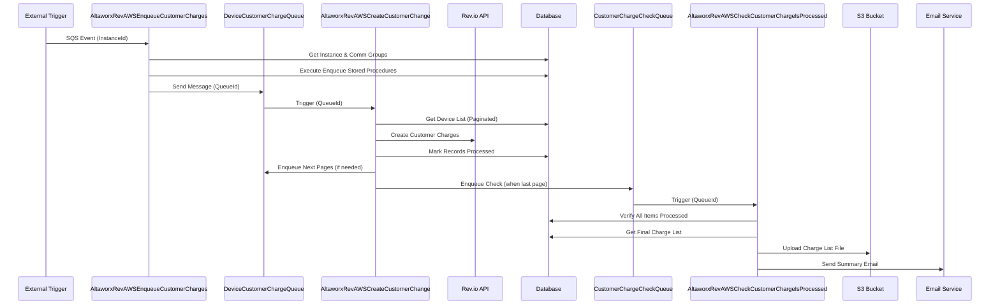

# Non-Recurring Customer Charges - End-to-End Flow

## Overview

The Non-Recurring Customer Charges system consists of three AWS Lambda functions that work together to process, create, and verify customer charges. This document provides a comprehensive end-to-end flow of how these three Lambdas interact to handle customer charge processing.

## Architecture Components

### 1. **AltaworxRevAWSEnqueueCustomerCharges** (Enqueue Lambda)
- **Purpose**: Initiates the customer charge process by enqueuing charge requests
- **Trigger**: SQS Event
- **Key Files**: 
  - `AltaworxRevAWSEnqueueCustomerCharges.cs`
  - `SqsValues.cs`

### 2. **AltaworxRevAWSCreateCustomerChange** (Create Lambda)
- **Purpose**: Processes individual customer charges and creates them in Rev.io
- **Trigger**: SQS Event (from Enqueue Lambda)
- **Key Files**:
  - `AltaworxRevAWSCreateCustomerChange.cs`
  - `CustomerChangeEventHandler.cs`
  - `DeviceCustomerChargeService1.cs`
  - `DeviceCustomerChargeQueueRepository.cs`
  - `CustomerChargeListFileService.cs`
  - `CustomerChargeListEmailService.cs`
  - `DeviceChargeRepository.cs`
  - `SqsValues1.cs`
  - `CustomerChargeUploadedFile.cs`
  - `CustomerChargeResponse.cs`

### 3. **AltaworxRevAWSCheckCustomerChargeIsProcessed** (Check Lambda)
- **Purpose**: Verifies charge processing completion and sends summary emails
- **Trigger**: SQS Event (from Create Lambda)
- **Key Files**:
  - `AltaworxRevAWSCheckCustomerChargeIsProcessed.cs`
  - `AltaworxRevAWSCheckCustomerChargeIsProcessed1.cs`
  - `CheckIsProcessedService.cs`
  - `ICheckIsProcessedService.cs`

## Detailed Sequence Flow

### High-Level Sequence Diagram


## End-to-End Flow

### Phase 1: Charge Enqueueing (AltaworxRevAWSEnqueueCustomerCharges)

#### 1.1 Initial Trigger
- Lambda receives SQS event with `InstanceId` in message attributes
- Extracts `SqsValues` from the message containing:
  - `IsMultipleInstanceId`
  - `IsLastInstanceId` 
  - `InstanceIds`
  - `CurrentIntegrationAuthenticationId`

#### 1.2 Instance Processing
```
ProcessInstance(instanceId, sqsValues)
├── Get OptimizationInstance from database
├── Load optimization settings by TenantId
├── Get communication groups for the instance
└── For each communication group:
    ├── Get winning queue ID based on portal type
    │   ├── M2M Portal (PortalTypeId = 0)
    │   ├── Mobility Portal (PortalTypeId = 2)
    │   └── Cross Provider Portal
    └── Enqueue customer charges for the queue
```

#### 1.3 Queue Selection Logic
- **M2M Devices**: Uses `GetDeviceWinningQueueSql()` - queries `OptimizationDeviceResult`
- **Mobility Devices**: Uses `GetMobilityDeviceWinningQueueSql()` - queries `OptimizationMobilityDeviceResult`
- **Cross Provider**: Uses `GetCrossProviderDeviceWinningQueueSql()` - queries both device result tables
- Selects queue with lowest `TotalCost` that has completed (`RunEndTime IS NOT NULL`)

#### 1.4 Database and SQS Enqueueing
```
EnqueueCustomerCharges(queueId, portalTypeId, sqsValues)
├── Database Enqueueing:
│   ├── Execute stored procedure: usp_Optimization_EnqueueCustomerCharges (M2M)
│   └── Execute stored procedure: usp_Optimization_Mobility_EnqueueCustomerCharges (Mobility)
└── SQS Enqueueing:
    ├── Send message to DeviceCustomerChargeQueueUrl
    ├── Include message attributes: QueueId, PortalTypeId, InstanceIds, etc.
    └── Apply 5-minute delay if this is the last instance
```

### Phase 2: Charge Creation (AltaworxRevAWSCreateCustomerChange)

#### 2.1 Event Processing
- Lambda receives SQS message from Enqueue Lambda
- `CustomerChangeEventHandler` processes the event
- Extracts `QueueId` or `FileId` from message attributes
- Creates `SqsValues` object with enhanced attributes:
  - `IsMultipleInstanceId`, `IsLastInstanceId`
  - `PortalTypeId`, `CurrentIntegrationAuthenticationId`
  - `PageNumber`, `RetryNumber`, `RetryCount`
  - `IsSendSummaryEmailForMultipleInstanceStep`

#### 2.2 Device Processing Logic
```
DeviceCustomerChargeService.ProcessQueueAsync(queueId, instance, sqsValues)
├── Determine customer type:
│   ├── Non-Rev Customer: AMOPCustomerId != null && RevCustomerId == null
│   └── Rev Customer: Has IntegrationAuthenticationId
├── Get device list (paginated, PAGE_SIZE = 50)
├── Process based on customer type:
│   ├── Non-Rev: ProcessCustomerChargeForNonRev()
│   └── Rev: ProcessCustomerChargeForRev()
└── Handle pagination and completion
```

#### 2.3 Rev Customer Processing
```
ProcessCustomerChargeForRev()
├── Get RevIO authentication details
├── Get optimization settings and billing timezone
├── Process each device in the list:
│   ├── Check if new logic is enabled (UsingNewProcessInCustomerCharge)
│   ├── Split charges into Rate Charge and Overage Charge (if new logic)
│   ├── Process Usage Charges via Rev.io API
│   ├── Process SMS Charges via Rev.io API
│   └── Mark record as processed in database
├── Calculate total pages for pagination
├── Enqueue additional pages if needed
└── Enqueue Check Lambda when last page is processed
```

#### 2.4 Non-Rev Customer Processing
```
ProcessCustomerChargeForNonRev()
├── Mark all devices as processed (no Rev.io integration)
├── Calculate total pages
├── Enqueue additional pages if needed
└── Enqueue Check Lambda when last page is processed
```

#### 2.5 Charge Creation via Rev.io API
```
DeviceChargeRepository.AddChargeAsync()
├── Serialize charge request to JSON
├── Call RevioApiClient.AddChargeAsync()
├── Handle API response:
│   ├── Success: Return ChargeId
│   └── Error: Return error details
└── Return CustomerChargeResponse
```

#### 2.6 Pagination and Re-enqueueing
- Each queue is processed in pages of 50 devices
- If multiple pages exist, additional SQS messages are sent for each page
- When the last page is processed, the Check Lambda is enqueued

#### 2.7 Detailed Charge Processing Flow
```
For each device in deviceList:
├── Determine charge type and integration settings
├── Process Usage Charges:
│   ├── New Logic (if UsingNewProcessInCustomerCharge = true):
│   │   ├── Rate Charge: Create charge for base rate portion
│   │   └── Overage Charge: Create charge for overage portion
│   └── Old Logic: Create single combined charge
├── Process SMS Charges (if applicable):
│   ├── Check SmsChargeAmount > 0
│   ├── Verify SmsRevProductTypeId or SmsRevProductId exists
│   └── Create SMS charge via Rev.io API
├── Handle API Responses:
│   ├── Success: Store ChargeId and mark as processed
│   ├── Rate Limit (429): Re-enqueue with retry count
│   └── Error: Mark as failed with error message
└── Update database record with final status
```

### Phase 3: Completion Verification (AltaworxRevAWSCheckCustomerChargeIsProcessed)

#### 3.1 Event Processing
- Lambda receives SQS message from Create Lambda
- `CheckIsProcessedEventHandler` processes the event
- Extracts `QueueId` or `FileId` from message attributes

#### 3.2 Processing Verification
```
CheckIsProcessedService.ProcessQueueAsync(queueId, instance, sqsValues)
├── Check if queue has more unprocessed items
├── If no more items:
│   ├── Get complete charge list from database
│   ├── Generate charge list file (.txt format)
│   ├── Upload file to S3 bucket
│   ├── Wait for S3 upload completion (5-minute timeout)
│   └── Send summary email with results
└── If items still processing:
    ├── Check retry count
    ├── Re-enqueue Check Lambda with 15-minute delay
    └── Max retries exceeded: Log error
```

#### 3.3 File Generation and S3 Upload
```
File Generation Process:
├── CustomerChargeListFileService.GenerateChargeListFile()
│   ├── Create tab-separated text file
│   ├── Include headers: MSISDN, IsSuccessful, ChargeId, ChargeAmount, etc.
│   ├── Add charge details for each device
│   └── Include summary totals
├── S3Wrapper.UploadAwsFile()
│   ├── Upload to CustomerChargesS3BucketName
│   ├── Filename format: {queueId}.txt or {fileId}.txt
│   └── Wait for upload completion
```

#### 3.4 Email Summary
```
Email Summary Process:
├── Single Instance:
│   └── Send email immediately with charge list attachment
├── Multiple Instances:
│   ├── Check if all instances are completed
│   ├── If completed: Send consolidated summary email
│   └── If still processing: Re-enqueue with delay
└── Email includes:
    ├── Charge list file attachment
    ├── Error count summary
    ├── Customer information
    └── Processing statistics
```

## Data Flow

### 1. SQS Message Flow
```
Optimization Trigger
    ↓ (SQS Message with InstanceId)
AltaworxRevAWSEnqueueCustomerCharges
    ↓ (SQS Message with QueueId)
AltaworxRevAWSCreateCustomerChange
    ↓ (SQS Message with QueueId - when last page processed)
AltaworxRevAWSCheckCustomerChargeIsProcessed
    ↓ (Email Summary + S3 File)
End User Notification
```

### 2. Database Operations

#### Enqueue Lambda Database Operations:
- Query `OptimizationInstance` for instance details
- Query `OptimizationQueue` for winning queues
- Execute stored procedures:
  - `usp_Optimization_EnqueueCustomerCharges` (M2M)
  - `usp_Optimization_Mobility_EnqueueCustomerCharges` (Mobility)

#### Create Lambda Database Operations:
- Query device lists via stored procedures:
  - `GET_OPTIMIZATION_DEVICE_RESULT_CUSTOMER_CHARGE_QUEUE`
  - `GET_OPTIMIZATION_MOBILITY_DEVICE_RESULT_CUSTOMER_CHARGE_QUEUE`
- Update processed records with charge results
- Track processing status and error information

#### Check Lambda Database Operations:
- Verify completion status of all queue items
- Retrieve final charge list for reporting
- Check multiple instance processing status

### 3. Rev.io API Integration
```
Rev Customer Charge Creation:
├── Authentication via RevioApiAuthentication
├── Create Usage Charges:
│   ├── Rate Charges (if new logic enabled)
│   └── Overage Charges (if new logic enabled)
├── Create SMS Charges (if applicable)
├── Handle API responses and errors
└── Update database with charge IDs and status
```

## Key Features

### 1. **Portal Type Support**
- **M2M Portal** (PortalTypeId = 0): IoT device charges
- **Mobility Portal** (PortalTypeId = 2): Mobile device charges  
- **Cross Provider**: Handles both M2M and Mobility

### 2. **Customer Type Support**
- **Rev Customers**: Full Rev.io integration with API calls
- **Non-Rev Customers**: Simplified processing without Rev.io calls

### 3. **Pagination**
- Processes devices in batches of 50 (PAGE_SIZE = 50)
- Automatically enqueues additional pages
- Tracks page progress via `PageNumber` attribute

### 4. **Error Handling and Retry Logic**
- **Create Lambda**: Retry failed charges up to MAX_RETRY_COUNT
- **Check Lambda**: Retry verification up to NUMBER_OF_RETRIES with 15-minute delays
- **Rate Limiting**: Handle Rev.io API rate limits (HTTP 429)
- **Error Notifications**: Send email alerts for processing errors

### 5. **Multiple Instance Processing**
- Support for processing multiple optimization instances
- Coordinate completion across instances
- Send consolidated summary emails for multiple instances
- Use `IsLastInstanceId` flag to trigger final processing steps

### 6. **File and Email Management**
- Generate tab-separated charge list files
- Upload files to S3 with automatic retry
- Send email summaries with file attachments
- Support both individual and consolidated reporting

## Configuration Requirements

### Environment Variables:
- `DeviceCustomerChargeQueueUrl`: SQS queue for charge creation
- `CustomerChargeCheckIsProcessedUrl`: SQS queue for completion verification
- `CustomerChargesS3BucketName`: S3 bucket for charge list files
- `ConnectionString`: Database connection string
- `SendToRev`: Flag to enable/disable Rev.io API calls
- `ProxyUrl`: Proxy URL for external communications

### Database Dependencies:
- Optimization tables (Instance, Queue, DeviceResult, MobilityDeviceResult)
- Customer charge queue tables
- Service provider configuration
- Rev.io authentication settings

## Error Scenarios and Handling

### 1. **Rev.io API Failures**
- Log API errors with detailed messages
- Mark charges as failed with error descriptions
- Continue processing remaining charges
- Send error notification emails

### 2. **Rate Limiting (HTTP 429)**
- Detect rate limit responses
- Re-enqueue failed charges with retry count
- Apply exponential backoff via SQS delay
- Maximum retry limits prevent infinite loops

### 3. **Database Connection Issues**
- Implement SQL retry policies using Polly
- Handle transient connection failures
- Log connection errors for monitoring

### 4. **S3 Upload Failures**
- Retry file uploads with timeout handling
- Log upload failures for investigation
- Prevent email sending if file upload fails

### 5. **Multiple Instance Coordination**
- Track completion status across instances
- Handle scenarios where some instances fail
- Implement timeout mechanisms for stuck instances
- Send partial summaries when timeouts occur

## Monitoring and Logging

### Log Categories:
- **SUB**: Method entry/exit tracking
- **INFO**: General information and status updates
- **WARNING**: Non-critical issues (e.g., Rev.io disabled)
- **EXCEPTION**: Error conditions and failures

### Key Metrics to Monitor:
- Queue processing times
- Rev.io API response rates and errors
- S3 upload success rates
- Email delivery status
- Retry counts and failure patterns

## Detailed Implementation Specifics

### SQS Message Attributes

#### Enqueue Lambda → Create Lambda
```json
{
  "QueueId": "12345",
  "IsMultipleInstanceId": "1",
  "IsLastInstanceId": "0", 
  "InstanceIds": "123,456,789",
  "PortalTypeId": "0",
  "CurrentIntegrationAuthenticationId": "100"
}
```

#### Create Lambda → Check Lambda
```json
{
  "QueueId": "12345",
  "IsMultipleInstanceId": "1",
  "IsLastInstanceId": "1",
  "InstanceIds": "123,456,789", 
  "PortalTypeId": "0",
  "CurrentIntegrationAuthenticationId": "100",
  "IsSendSummaryEmailForMultipleInstanceStep": "1",
  "RetryNumber": "0"
}
```

### File Processing Alternative Flow

#### File-Based Processing (Alternative to Queue-Based)
```
File Upload Trigger
    ↓ (FileId)
AltaworxRevAWSCreateCustomerChange
    ├── ProcessQueueAsync(fileId, sqsValues)
    ├── Get CustomerChargeUploadedFile details
    ├── Process devices from file-based queries
    ├── Create charges via Rev.io API
    ├── Enqueue Check Lambda with FileId
    └── Mark file processing complete

AltaworxRevAWSCheckCustomerChargeIsProcessed
    ├── ProcessQueueAsync(fileId, sqsValues)
    ├── Verify file processing completion
    ├── Generate and upload charge list file
    └── Send summary email for file
```

### Database Schema Dependencies

#### Key Tables:
- **OptimizationInstance**: Instance configuration and customer mapping
- **OptimizationQueue**: Queue definitions and winning queue selection
- **OptimizationDeviceResult**: M2M device optimization results
- **OptimizationMobilityDeviceResult**: Mobility device optimization results
- **CustomerCharge_UploadedFile**: File-based charge upload tracking
- **Customer tables**: Rev and Non-Rev customer information

#### Key Stored Procedures:
- `usp_Optimization_EnqueueCustomerCharges`
- `usp_Optimization_Mobility_EnqueueCustomerCharges`
- `GET_OPTIMIZATION_DEVICE_RESULT_CUSTOMER_CHARGE_QUEUE`
- `GET_OPTIMIZATION_MOBILITY_DEVICE_RESULT_CUSTOMER_CHARGE_QUEUE`
- `DEVICE_CUSTOMER_CHARGE_QUEUE_GET_CHARGE_LIST`
- `MOBILITY_DEVICE_CUSTOMER_CHARGE_QUEUE_GET_CHARGE_LIST`

### Rev.io API Integration Details

#### Charge Creation Request Structure:
```csharp
CreateDeviceChargeRequest {
    CustomerId: Guid,
    ProductId: int?,
    ProductTypeId: int?,
    Amount: decimal,
    Description: string,
    BillingPeriodStart: DateTime,
    BillingPeriodEnd: DateTime,
    // Additional metadata fields
}
```

#### API Response Handling:
- **Success (200)**: Extract ChargeId, mark as processed
- **Rate Limit (429)**: Re-enqueue with retry logic
- **Client Error (4xx)**: Mark as failed, log error
- **Server Error (5xx)**: Retry with exponential backoff

### Timing and Delays

#### SQS Delay Configuration:
- **Normal Processing**: 0 seconds delay
- **Last Instance**: 5 minutes delay (300 seconds)
- **Retry Processing**: 10 seconds delay
- **Check Verification**: 15 minutes delay (900 seconds)

#### Timeout Configuration:
- **Database Commands**: 240 seconds
- **S3 Upload Wait**: 5 minutes (300 seconds)
- **HTTP Requests**: Configurable via retry policies

## Summary

This system provides a robust, scalable solution for processing non-recurring customer charges with the following key characteristics:

1. **Asynchronous Processing**: Uses SQS for decoupled, scalable processing
2. **Fault Tolerance**: Comprehensive error handling and retry mechanisms
3. **Flexibility**: Supports multiple portal types and customer configurations
4. **Monitoring**: Extensive logging and email notifications
5. **Efficiency**: Pagination and batch processing for large datasets
6. **Integration**: Seamless Rev.io API integration with fallback options
7. **Dual Processing Modes**: Supports both queue-based and file-based processing
8. **Advanced Charge Logic**: Supports both legacy and new charge splitting logic

The flow ensures that customer charges are processed reliably, with proper error handling, monitoring, and user notification throughout the entire process. The system handles both simple single-instance scenarios and complex multi-instance coordination with appropriate delays and verification steps.